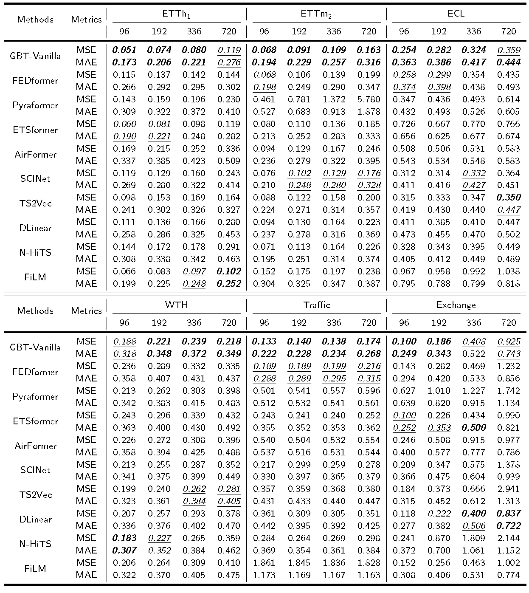

# GBT: Two-stage Transformer Framework for Non-stationary Time Series Forecasting


Source code of paper: [GBT: Two-stage Transformer Framework for Non-stationary Time Series Forecasting] (Manuscript submitted to Neural Networks).


## Requirements

- Python 3.8
- matplotlib == 3.3.4
- numpy == 1.20.1
- pandas == 1.2.4
- scikit_learn == 0.24.1
- scipy == 1.9.0
- torch == 1.11.0

Dependencies can be installed using the following command:
```bash
pip install -r requirements.txt
```

## Data

ETT, ECL, Traffic, Exchange, weather and ILI datasets were acquired at: [datasets](https://drive.google.com/drive/folders/1ZOYpTUa82_jCcxIdTmyr0LXQfvaM9vIy?usp=sharing); 
WTH dataset was acquired at: [WTH](https://drive.google.com/drive/folders/1ohGYWWohJlOlb2gsGTeEq3Wii2egnEPR?usp=sharing).

### Data Preparation
After you acquire raw data of all datasets, please separately place them in corresponding folders at `./data`. 

We place ETT in the folder `./ETT-data`, ECL in the folder `./electricity`, Exchange in the folder `./exchage_rate`, ILI in the folder `./illness`, Traffic in the folder `./traffic` and weather in the folder `./weather` of [here](https://drive.google.com/drive/folders/1ZOYpTUa82_jCcxIdTmyr0LXQfvaM9vIy?usp=sharing) (the folder tree in the link is shown as below) into folder `./data` and rename them from `./ETT-data`,`./electricity`, `./exchange_rate`, `./illness`, `./traffic` and `./weather` to `./ETT`, `./ECL`, `./Exchange`, `./ILI`, `./Traffic` and`./weather` respectively. We rename the file of ECL/Exchange from `electricity.csv`/ `exchange_rate.csv`/ `national_illness.csv`/ `traffic.csv` to `ECL.csv`/ `Exchange.csv`/ `ILI.csv`/ `Traffic.csv` and rename the last variable of ECL/Exchange/Traffic from `OT` to original `MT_321`/ `Singapore`/ `Sensor_861`.

```
|-Autoformer
| |-ETT-data
| | |-ETTh1.csv
| | |-ETTh2.csv
| | |-ETTm1.csv
| | |-ETTm2.csv
| |
| |-electricity
| | |-electricity.csv
| |
| |-exchange_rate
| | |-exchange_rate.csv
| |
| |-illness
| | |-national_illness.csv
| |
| |-traffic
| | |-traffic.csv
| |
| |-weather
| | |-weather.csv
```

We place the file `WTH.csv` in [here](https://drive.google.com/drive/folders/1ohGYWWohJlOlb2gsGTeEq3Wii2egnEPR?usp=sharing) (the folder tree in the link is shown as below) into folder `./WTH`.

```
|-WTH.csv
```

Then you can get the folder tree shown as below:

```
|-data
| |-ECL
| | |-ECL.csv
| |
| |-ETT
| | |-ETTh1.csv
| | |-ETTh2.csv
| | |-ETTm1.csv
| | |-ETTm2.csv
| |
| |-Exchange
| | |-Exchange.csv
| |
| |-ILI
| | |-ILI.csv
| |
| |-Traffic
| | |-Traffic.csv
| |
| |-weather
| | |-weather.csv
| |
| |-WTH
| | |-WTH.csv

```


## Usage
Commands for training and testing the GBT on Dataset ETT, ECL, WTH, Traffic, Exchange and Weather respectively in the file named as `./scripts/GBT_data.sh`. 

More parameter information please refer to `main.py`.

Here we provide command descriptions for training and testing the GBT combined with different models separately: 

GBT-Vanilla:
```
python -u main.py --root_path <root_path> --model <model> --data <data> --features <features> --seq_len <seq_len> --label_len <label_len> --pred_len <pred_len> --target <target> --s_layers <s_layers> --d_layers <d_layers> --attn <attn> --des <des> --itr <itr> --learning_rate <learning_rate>	--dropout <dropout> --fd_model <fd_model> --d_model <d_model> --format <format> --use_RevIN <use_RevIN>  --instance <instance> --criterion <criterion> --test_inverse
```
GBT+FEDformer:
```
python -u main.py --root_path <root_path> --model <model> --data <data> --features <features> --seq_len <seq_len> --label_len <label_len> --pred_len <pred_len> --target <target>  --hidden_size <hidden_size> --num_levels <num_levels>	--num_stacks <num_stacks> 	--num_groups <num_groups> 	--concat_len <concat_len> 	--INN <INN> 	--dilation <dilation> --positionalEcoding <positionalEcoding>  --single_step_output_One <single_step_output_One>  --des <des> --itr <itr> --learning_rate <learning_rate>	--dropout <dropout> --d_model <d_model> --instance <instance> --criterion <criterion> --test_inverse 
```
GBT+ETSformer:
```
python -u main.py --root_path <root_path> --model <model> --data <data> --features <features> --seq_len <seq_len> --label_len <label_len> --pred_len <pred_len> --target <target>  --s_layers <s_layers> --d_layers <d_layers> --attn <attn> --version <version> --L <L> --moving_avg <moving_avg> --des <des> --itr <itr> --learning_rate <learning_rate>	--dropout <dropout> --d_model <d_model> --instance <instance>  --criterion <criterion> --test_inverse
```
GBT+SCINet:
```
python -u main.py --root_path <root_path> --model <model> --data <data> --features <features> --seq_len <seq_len> --label_len <label_len> --pred_len <pred_len> --target <target>  --s_layers <s_layers> --d_layers <d_layers> --attn <attn> --sigma <sigma> --K <K> --des <des> --itr <itr> --learning_rate <learning_rate>	--dropout <dropout> --d_model <d_model> --instance <instance> --criterion <criterion> --test_inverse
```
GBT+N-BEATS:
```
python -u main.py --root_path <root_path> --model <model> --data <data> --features <features> --seq_len <seq_len> --label_len <label_len> --pred_len <pred_len> --target <target>  --trend_blocks <trend_blocks> --trend_layers <trend_layers> --trend_layer_size <trend_layer_size> --degree_polynomical <degree_polynomical> --seasonality_blocks <seasonality_blocks> --seasonality_layers <seasonality_layers> --seasonality_layer_size <seasonality_layer_size> --des <des> --itr <itr> --learning_rate <learning_rate>	--dropout <dropout> --num_of_harmonics <num_of_harmonics> --d_model <d_model> --instance <instance> --criterion <criterion> --test_inverse
```
GBT+N-HiTS:
```
python -u main.py --root_path <root_path> --model <model> --data <data> --features <features> --seq_len <seq_len> --label_len <label_len> --pred_len <pred_len> --target <target>  --n_s_hidden <n_s_hidden> --n_x <n_x> --stack_num <stack_num> --n_blocks <n_blocks> --n_layers <n_layers> --n_hidden <n_hidden> --n_pool_kernel_size <n_pool_kernel_size> --n_freq_downsample <n_freq_downsample> --dropout_prob_theta <dropout_prob_theta> --batch_normalization <batch_normalization> --share_weights <share_weights> --des <des> --itr <itr> --learning_rate <learning_rate>	--dropout <dropout> --d_model <d_model> --instance <instance> --criterion <criterion> --test_inverse
```
Detailed descriptions of arguments are shown in `main.py`.

## Results
The experiment parameters of each dataset are formated in the `GBT_data.sh` files in the directory `./scripts/`. You can refer to these parameters for experiments, and you can also adjust the parameters to obtain better MSE and MAE results or draw better prediction figures.

<p align="center">

<br><br>
<b>Figure 1.</b> Multivariate forecasting results
</p>

<p align="center">

<br><br>
<b>Figure 2.</b> Univariate forecasting results
</p>


## Contact
If you have any questions, feel free to contact Li Shen through Email (shenli@buaa.edu.cn) or Github issues. Pull requests are highly welcomed!
